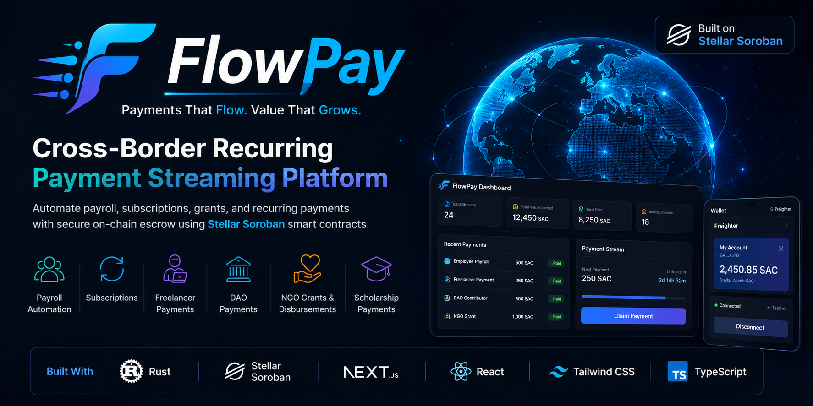

<div align="center">



# 🚀 FlowPay

### Cross-Border Recurring Payment Streaming Platform on Stellar Soroban

*Automating payroll, subscriptions, grants, and recurring payments with secure on-chain smart contracts.*


</div>


---

# 🌍 Overview

FlowPay is a decentralized recurring payment platform built on **Stellar Soroban**.

It enables organizations, businesses, DAOs, NGOs, and individuals to automate recurring cross-border payments securely using smart contracts.

Instead of manually sending payments every week or month, FlowPay creates programmable payment streams that recipients can claim as they become available.

---

# ✨ Features

- 🌍 Cross-border recurring payments
- 💼 Employee payroll
- 👨‍💻 Freelancer payments
- 🔄 Subscription billing
- 🏛 DAO contributor compensation
- 🎓 Scholarship disbursement
- ❤️ NGO grant distribution
- 💰 Multi-token support
- 🔐 Escrow-based payment streaming
- ⚡ Soroban smart contracts
- 👛 Freighter wallet integration
- 📊 Modern dashboard

---

# 🏗 Architecture

```text
                 Employer

                     │

                     ▼

          Next.js + React Frontend

                     │

             Stellar RPC Server

                     │

                     ▼

         FlowPay Soroban Contract

          ┌──────────┴──────────┐

          │                     │

     Stream Storage      Payment Storage

          │                     │

          └──────────┬──────────┘

                     ▼

              SAC Token Contract

                     │

                     ▼

                 Recipient
```

---

# 🔄 Payment Flow

```text
Employer

     │

Create Stream

     │

Deposit Funds

     │

Funds Locked in Escrow

     │

Scheduled Unlock Time

     │

Recipient Claims Payment

     │

Token Transfer Executed

     ▼

Payment Recorded On-chain
```

---

# 🛠 Tech Stack

## Smart Contract

- Rust
- Soroban SDK
- Stellar Protocol
- Soroban RPC

## Frontend

- Next.js
- React
- TypeScript
- Tailwind CSS
- Stellar SDK
- Freighter Wallet API

---

# 📂 Project Structure

```text
flowPay/

├── contracts/
│   └── payment_stream/
│
├── frontend/
│
├── scripts/
│
├── Cargo.toml
│
├── Makefile
│
└── README.md
```

---

# 🚀 Getting Started

## Clone

```bash
git clone https://github.com/greatKhalifa-code/flowPay.git

cd flowPay
```

---

## Smart Contract

```bash
cargo test

cargo build --target wasm32v1-none --release
```

---

## Frontend

```bash
cd frontend

npm install

npm run dev
```

Open:

```
http://localhost:3000
```

---

# 📦 Smart Contract Capabilities

- Initialize FlowPay
- Create recurring payment streams
- Deposit payment funds
- Claim unlocked payments
- Pause streams
- Resume streams
- Cancel future payments
- Track payment history
- Secure escrow management

---

# 🔐 Security

FlowPay is designed around secure smart contract principles.

Implemented protections include:

- Authorization checks
- Escrow-based fund custody
- Double-claim prevention
- Overflow-safe arithmetic
- Event logging
- Structured error handling
- Persistent storage management
- Type-safe contract interactions

---

# 🧪 Testing

Run the contract tests:

```bash
cargo test
```

Build optimized WASM:

```bash
cargo build --target wasm32v1-none --release
```

Build frontend:

```bash
cd frontend

npm run build
```

---

# 🛣 Roadmap

- ✅ Payment Streams
- ✅ Escrow Contract
- ✅ Freighter Integration
- ✅ Soroban RPC
- ✅ Next.js Frontend
- ✅ TypeScript Support
- ⏳ Testnet Deployment
- ⏳ Mainnet Deployment
- ⏳ Analytics Dashboard
- ⏳ Multi-wallet Support

---

# 🌟 Why FlowPay?

FlowPay directly supports Stellar's mission of making money more fluid, markets more open, and people more empowered.

Use cases include:

- Payroll Automation
- Subscription Infrastructure
- DAO Contributor Payments
- NGO Aid Distribution
- Scholarship Payments
- Freelancer Compensation
- Cross-border Business Payments

---

# 🤝 Contributing

Contributions are welcome.

Please open an issue or submit a pull request to discuss improvements.

---

# 📄 License

This project is licensed under the MIT License.

---

<div align="center">

Built with ❤️ using **Stellar Soroban**, **Rust**, and **Next.js**

</div>
